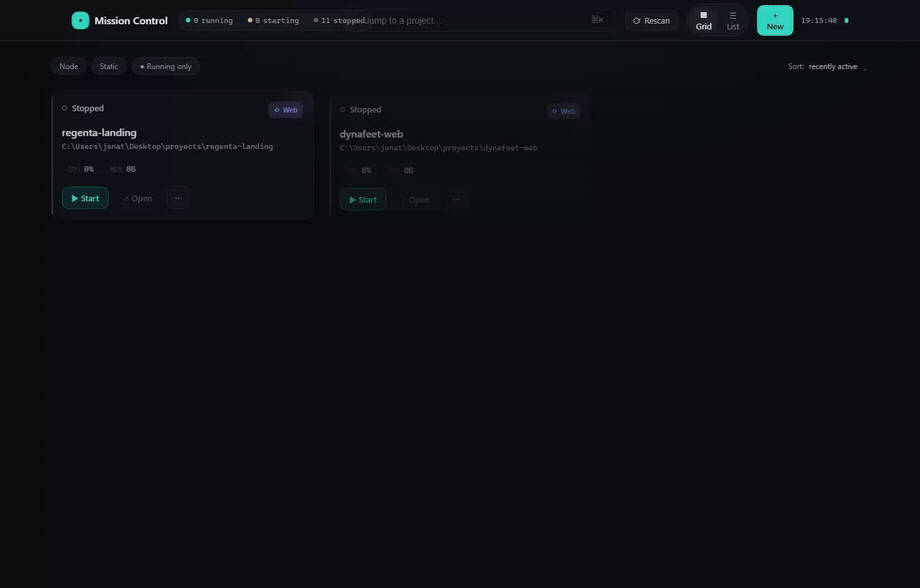

# 🛰️ Mission Control

[](https://www.npmjs.com/package/@fervon/launchpad)


> One folder, a dozen repos, one screen — no port collisions.

Point Mission Control at the folder where you keep your projects and press start.
It auto-detects every dev project, infers how to launch each one from its *own*
files, and runs them all at once on collision-free ports — with live logs, git
status, and health in a single view. No `cd` rituals, no port-clash detective
work, no stray `node` holding port 5173 from yesterday.

<p align="center">
  
</p>

> 🔒 **Local-only by design.** Binds **`127.0.0.1`** (HTTP + WebSocket), never
> `0.0.0.0`. No accounts, no telemetry, no phone-home.

Part of [Fervon](https://fervon.dev) — a small studio of local-first developer tools.

> ⭐ **If Mission Control saves you a single `cd` + port-clash hunt, [give it a star](https://github.com/JoniMartin27/launchpad) — it's the fastest way to help it grow.** Got a project it can't auto-detect, or an idea? [Open an issue](https://github.com/JoniMartin27/launchpad/issues).

## Why

If you keep a dozen projects in one folder, you know the dance: `cd` into each
one, remember its dev command, discover two of them both want port 5173, kill
the stray `node` that's still holding a port from yesterday. Mission Control
replaces all of that with one screen.

## Features

- **Zero-config auto-detection, polyglot** — scans your projects folder and
  infers each project's type and dev command from its own files:
  - **JS/TS** — Vite (React / Vue / Svelte / SvelteKit / Solid / Preact), Next,
    Nuxt, Remix, Astro, Electron, Express / Fastify / Koa / hapi / Hono / NestJS,
    static sites, Telegram & Discord bots, CLIs, workspace monorepos, and
    `backend/`+`frontend/` splits.
  - **Python** — FastAPI, Django, Flask. **Go** (`go.mod`), **Rust** (`Cargo.toml`),
    **Deno** (`deno.json` tasks). Docker Compose stacks are detected and
    labelled (not launched — see below).
- **Uses your package manager** — the dev and install commands follow the
  project's lockfile: `pnpm dev` for `pnpm-lock.yaml`, `yarn` / `bun run` / `npm run`
  likewise. Mission Control never runs `npm install` inside a pnpm workspace.
- **Launch many at once, never a port clash** — every project gets a unique port
  in a configurable range (default `4000–4099`), injected at launch (`PORT` env +
  the right CLI flag per framework). Run five at the same time, all isolated.
- **Live logs** streamed over WebSocket (ANSI-clean), with filter / follow / clear.
- **Git at a glance** — branch, dirty count, ahead/behind, last commit.
- **Health** — npm/PyPI published version + GitHub CI status (via `gh`), cached.
- **Friendly failures** — missing `node_modules`? A one-click **Install** button.
  Missing env/token? A clear hint instead of a red wall.
- **Live re-scan** — drop a new project folder in and it animates into the grid,
  and edit a project's manifest (or add a lockfile) and its card re-classifies
  itself. No restart, no Rescan button. Watching is filtered to the manifests
  that matter, so build output costs nothing.
- **Clean process control** — start/stop with a full process-tree kill on both
  platforms (`taskkill /T /F` on Windows; SIGTERM to the process group, then
  SIGKILL, on macOS/Linux), so nothing is left holding a port.

## Quick start

Run it from the folder that holds your projects:

```sh
cd ~/code
npx @fervon/launchpad
```

Open <http://127.0.0.1:7777>. On first run it scans that folder, writes a
`.launchpad.json` next to your projects (ports and per-project overrides live
there — add it to your global gitignore if you like), and shows the grid.
That's it. Nothing to configure, nothing installed globally.

```sh
npx @fervon/launchpad --port 7788      # dashboard on another port
npx @fervon/launchpad --root ~/work    # scan a different folder
npx @fervon/launchpad --help
```

### From source

```sh
git clone https://github.com/JoniMartin27/launchpad
cd launchpad
npm install
npm run build      # build the web UI
npm start          # serve UI + API + WS on http://127.0.0.1:7777
```

A checkout is meant to live **inside** the folder it manages, and scans its
parent — it excludes itself from the grid:

```
~/code/                     ← your projects root
├── project-a/
├── project-b/
└── launchpad/              ← clone here
```

> **Different projects folder?** `--root /path/to/code`, or the env var
> `MISSION_CONTROL_PROJECTS_ROOT`, or `settings.projectsRoot` in the config file.
>
> **Port 7777 already taken?** `--port 7788`, or `MISSION_CONTROL_PORT=7788`.
> Flags win over env vars, which win over the config file.

Mission Control excludes **itself** from the scan (by path, so the clone folder
can be called anything), and never launches what it cannot cleanly stop: Docker
Compose stacks are shown and labelled but have no Start button, because
`docker compose up` leaves containers that a process-tree kill would not reclaim.

### Dev mode (hot reload)

```sh
npm run dev        # Fastify (:7777) + Vite (:5180) with HMR
```

### Tests

```sh
npm test           # 135 server tests (node:test) + 14 frontend tests (vitest)
npm run test:server
npm run test:web
```

## How it works

| Module | Role |
|---|---|
| `server/src/discovery.js` | Scans the projects root, classifies each project generically (no hardcoded names), resolves unique ports. |
| `server/src/launcher.js`  | Spawns the dev command with the port injected, streams logs, tree-kills on stop. |
| `server/src/frameworks.js`| Per-framework table: how to inject the port (env var + CLI flag). |
| `server/src/watcher.js`   | Debounced `fs.watch` on the root → live add/remove of projects. |
| `server/src/git.js` · `metrics.js` | Git status and npm/PyPI/CI health, cached and non-blocking. |

See [`SPEC.md`](SPEC.md) for the full REST + WebSocket contract and
[`DESIGN.md`](DESIGN.md) for the UI design system.

## Configuration

Discovery is **hybrid**: an automatic filesystem scan, unioned with per-project
overrides in a machine-local config file — `.launchpad.json` in your projects
folder when installed from npm, or `config.json` at the repo root in a checkout
(git-ignored there; see [`config.example.json`](config.example.json)). Override
it entirely with `--config` / `MISSION_CONTROL_CONFIG`. Edit it by hand or from
the dashboard. Per project you can override:

| Field | Meaning |
|---|---|
| `port` | Pin the assigned port |
| `name` | Display name |
| `command` | Override the dev command |
| `portFlag` / `portEnv` | How the port is passed (e.g. `--port`, `PORT`) |
| `env` | Extra environment variables (`${PORT}` is substituted) |
| `hidden` / `runnable` | Hide a card / mark it non-launchable |
| `cwd` | Working directory |
| `registry` | Where the published-version badge looks: `{ "kind": "npm"|"pypi"|"none", "name": "pkg" }`. Only needed when the manifest cannot say it — e.g. a `private` workspace root whose published package is a member. |

Global settings live under `settings` (`projectsRoot`, `dashboardPort`,
`portRange`, `metricsTtlSec`, `readyRegex`, `autoScan`, `scanDepth`, `maxProjectWatchers`,
`editorCommand`).

### Projects in subfolders

Keep your work in `code/work/*` and `code/personal/*`? Mission Control scans
one level by default, notices it found nothing, **looks deeper on its own** and
says so in a banner — then remembers the depth that worked (`settings.scanDepth`,
max 3) so the grid stays stable. Nested projects are named after their trail
(`work/api`), so two folders both called `api` never collide.

A project folder is never descended into: a monorepo stays one card.

### Getting to a project

Open a card and the drawer offers the three things you would otherwise `cd` for:
**your editor**, **the folder**, and **a terminal already in it**. Set
`settings.editorCommand` to whatever you use (`code`, `subl`, `webstorm`,
`nvim`…); the file manager and terminal are chosen per platform.

Paths are taken from the catalog and passed to the tool as a separate argument
with no shell involved, so a folder with a `&` in its name cannot run anything.

### Bringing up a whole stack

Two buttons in the top bar act on what you can already see: **▶ Start N** starts
every startable project currently shown (respecting your search and filters, and
skipping anything already up or waiting on an install), and **⏻ Stop all** stops
everything that is running.

For a fixed set — front end, API and database, say — name it in the config:

```json
"profiles": {
  "stack": ["api", "web", "db"]
}
```

```sh
curl -X POST localhost:7777/api/batch/start -H 'content-type: application/json' -d '{"profile":"stack"}'
```

Batch responses are **per project**: one that cannot start never aborts the
rest, and the answer says exactly what happened to each — `started`,
`already-running`, `not-runnable`, `failed` with its reason. A partial batch
comes back as HTTP **207**, never a plain 200.

## Requirements

- **Node 20+** (CI runs on Node 20 and 22). Optional, per ecosystem you actually
  use: `git` and the GitHub `gh` CLI for the git/CI panels; `uv` for Python
  (FastAPI / Django / Flask); `go`, `cargo`, `deno`, `pnpm`, `yarn`, `bun` for
  those projects. All degrade gracefully if absent — a missing toolchain shows
  up as a friendly *needs-env* card, not a crash.
- **Windows, macOS and Linux.** CI runs the full suite on Windows *and* Linux,
  because process control differs per platform — the tree-kill test starts a
  real grandchild process on each and asserts it dies. Day-to-day development
  happens on Windows.

## Security posture

Single-user, loopback-only. Every request is checked for a loopback remote
address; the socket binds `127.0.0.1` exclusively. It launches processes you
already have on disk with commands derived from those projects — treat it like
running `npm run dev` yourself. See [`SECURITY.md`](SECURITY.md) for the threat
model and how to report an issue, and `SPEC.md` §9.

## Contributing

The single most useful thing you can send is **a project it failed to detect**:
open a [Project not detected](https://github.com/JoniMartin27/launchpad/issues/new?template=project-not-detected.yml)
issue with your manifest and folder layout. See [`CONTRIBUTING.md`](CONTRIBUTING.md)
for the dev loop and house rules, and [`CHANGELOG.md`](CHANGELOG.md) for what has
changed.

## License

MIT
